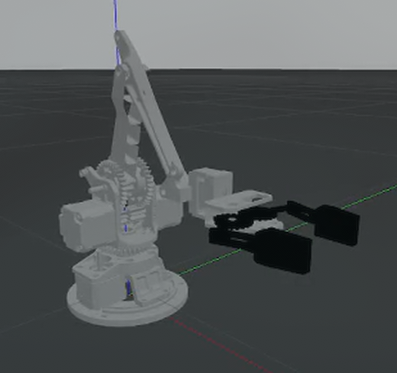

# 5-DOF Robot Arm with Gripper



> [!NOTE]
> This project implements a 5-DOF robotic arm with a gripper capable of performing pick and place operations in a Gazebo simulation environment.

## Quick Start

```bash
catkin build
source devel/setup.zsh
roslaunch move full_robot_arm_sim.launch
```

In a new terminal:

```bash
source devel/setup.zsh
rosrun move code.py
```

## Documentation

This project comes with comprehensive documentation:

- [Complete Documentation](DOCUMENTATION.md) - Full system overview and features
- [Technical Documentation](TECHNICAL_DOCUMENTATION.md) - Detailed code and architecture explanation
- [Setup Guide](SETUP_GUIDE.md) - Installation and setup instructions
- [Troubleshooting Guide](TROUBLESHOOTING_GUIDE.md) - Solutions to common issues

## Robot Structure

### Links

- `base_link` - The base of the robot
- `Link1` - First link of the arm
- `link2` - Second link of the arm
- `link3` - Third link of the arm
- `link4` - Fourth link of the arm
- `link5` - Fifth link of the arm (gripper base)
- `rightGripper` - Right gripper mechanism
- `r_finger` - Right finger of the gripper
- `leftGripper` - Left gripper mechanism
- `l_fing` - Left finger of the gripper

### Joints

- `joint1` - Connects base_link to Link1 (revolute)
- `joint2` - Connects Link1 to link2 (revolute)
- `joint3` - Connects link2 to link3 (revolute)
- `joint4` - Connects link3 to link4 (revolute)
- `joint5` - Connects link4 to link5 (revolute)
- `rgripper_joint` - Connects link5 to rightGripper (revolute)
- `r_fingerj` - Connects rightGripper to r_finger (revolute)
- `Lgripperjoint` - Connects link5 to leftGripper (revolute)
- `l_fing_j` - Connects leftGripper to l_fing (revolute)

## Video Demo

[[Robot Arm Demo]](media/videos/robot.mp4)
_Click on the image above to view the robot arm demonstration video_
